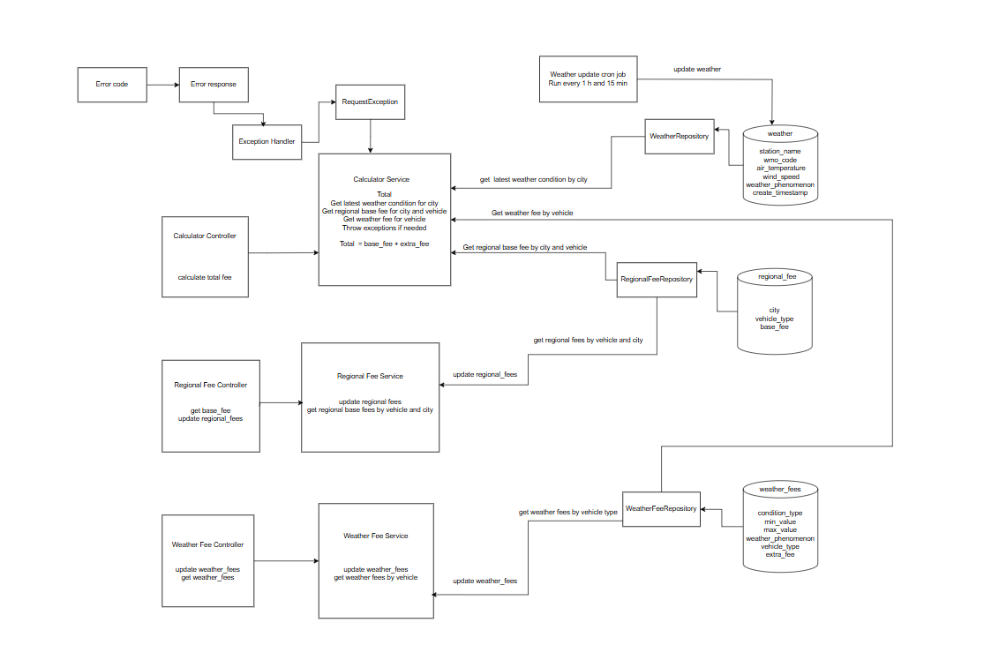

# Delivery Fee Calculator Service

This project provides a RESTful API for calculating delivery fees based on city, vehicle type, and current weather conditions. It includes features to manage regional fees, weather-based fees, and retrieve the latest weather data.

## Table of Contents

- [Requirements](#requirements)
- [Dependencies](#dependencies)
- [Database Setup (H2)](#database-setup-h2)
- [Installation](#installation)
- [Project Structure](#project-structure)
- [Endpoints](#endpoints)
    - [Fee Calculator](#fee-calculator)
    - [Regional Fees](#regional-fees)
    - [Weather Fees](#weather-fees)
- [Calculation Logic](#calculation-logic)
- [Weather Update Job](#weather-update-job)
- [Database Interactions](#database-interactions)
- [Error Handling](#error-handling)
- [Possible Improvements](#improvements-)

## Requirements

- Java 21
- Gradle

## Dependencies

-   Spring Boot
-   Lombok
-   Jackson XML
-   Spring JDBC
-   H2
-   RestTemplate

## Database Setup (H2)

The project uses an H2 in-memory database.
The database schema and initial data are defined in [init.sql](src/main/resources/init.sql). To initialize the database, ensure that the `init.sql` file is executed when the application starts. The application is configured to automatically run these scripts against the H2 database.

## Installation

To install and run the service, please follow these steps:

1. Clone the repository.
2. Navigate to the root directory of the project.
3. Run `gradle build` to build the application.
4. Run `java -jar build/libs/delivery-application-0.0.1-SNAPSHOT.jar` to start the application

The default port is 8080.

## Project Structure

## Endpoints

### Fee Calculator
N.B. all vehicleTypes must be same as [VehicleType](src/main/java/fujitsu/delivery/application/model/VehicleType.java) otherwise we will throw `VEHICLE_NOT_SUPPORTED`
-   **`GET /api/fee-calculator/{city}/{vehicleType}`**
    -   Calculates the delivery fee based on the city, vehicle type, and current weather conditions.
    -   **Parameters:**
        -   `city` (path variable): The name of the city.
        -   `vehicleType` (path variable): The type of vehicle.
    -   **Response:**
        -   `200 OK`: Returns the calculated fee as a double.
        -   `400 Bad Request`: If the city or vehicle type is not supported.

### Regional Fees

-   **`GET /api/regional-fee/{city}/{vehicleType}`**
    -   Retrieves the regional fee for a given city and vehicle type.
    -   **Parameters:**
        -   `city` (path variable): The name of the city.
        -   `vehicleType` (path variable): The type of vehicle.
    -   **Response:**
        -   `200 OK`: Returns the [RegionalFee](src/main/java/fujitsu/delivery/application/model/RegionalFee.java) object.
        -   `400 Bad Request`: If the city or vehicle type is not supported.
-   **`PUT /api/regional-fee/update`**
    -   Updates the base fee for a given city and vehicle type.
    -   **Request Body:**
        -   [RegionalFee](src/main/java/fujitsu/delivery/application/model/RegionalFee.java) object containing the updated base fee.
    -   **Response:**
        -   `200 OK`: Indicates successful update.
        -   `500 Internal Server Error`: If an error occurs during the update.

### Weather Fees

-   **`POST /weather-fee/add`**
    -   Saves or updates a weather fee rule.
    -   **Request Body:**
        -   [WeatherFee](src/main/java/fujitsu/delivery/application/model/WeatherFee.java) object containing the weather fee rule.
    -   **Response:**
        -   `200 OK`: Indicates successful save or update.
-   **`GET /weather-fee/{vehicleType}`**
    -   Retrieves weather fee rules for a given vehicle type.
    -   **Parameters:**
        -   `vehicleType` (path variable): The type of vehicle.
    -   **Response:**
        -   `200 OK`: Returns a list of [WeatherFee](src/main/java/fujitsu/delivery/application/model/WeatherFee.java) objects.

## Calculation Logic

The [CalculatorService](src/main/java/fujitsu/delivery/application/service/CalculatorService.java) calculates the delivery fee as follows:

1.  Retrieves the latest weather data for the specified city.
2.  Retrieves the base regional fee for the specified city and vehicle type.
3.  Retrieves all applicable weather fee rules for the specified vehicle type.
4.  Iterates through the weather fee rules and applies extra fees based on the current weather conditions:
    -   **Air Temperature:** Adds the extra fee if the current temperature is within the specified range.
    -   **Wind Speed:** Adds the extra fee if the current wind speed is within the specified range. If the extra fee is -1, throws a `WEATHER_NOT_SUPPORTED_FOR_VEHICLE` error.
    -   **Weather Phenomenon:** Adds the extra fee if the current weather phenomenon matches any of the specified phenomena. If the extra fee is -1, throws a `WEATHER_NOT_SUPPORTED_FOR_VEHICLE` error.
5.  Returns the sum of the base regional fee and the calculated extra fees.

## Weather Update Job

The [WeatherUpdateJob](src/main/java/fujitsu/delivery/application/jobs/WeatherUpdateJob.java) periodically retrieves weather data from an external XML source and updates the database.

-   Uses a scheduled cron job to fetch weather data.
-   Parses the XML response into [WeatherDataXML](src/main/java/fujitsu/delivery/application/model/WeatherDataXML.java) objects.
-   Filters the weather data for target cities (Tallinn-Harku, Tartu-Tõravere, Pärnu).
-   Maps the weather data to [Weather](src/main/java/fujitsu/delivery/application/model/Weather.java) objects.
-   Saves the weather data to the database.

## Database Interactions

-   **Regional Fees:**
    -   [RegionalFeeRepository](src/main/java/fujitsu/delivery/application/repository/impl/RegionalFeeRepositoryImpl.java) manages the `regional_fees` table.
    -   Provides methods to retrieve and update regional fees.
-   **Weather Fees:**
    -   [WeatherFeeRepository](src/main/java/fujitsu/delivery/application/repository/impl/WeatherFeeRepositoryImpl.java) manages the `weather_fees` table.
    -   Provides methods to save, update, and retrieve weather fee rules.
-   **Weather Data:**
    -   [WeatherRepository](src/main/java/fujitsu/delivery/application/repository/impl/WeatherRepositoryImpl.java) manages the `weather` table.
    -   Provides methods to save weather data and retrieve the latest weather data for a city.

## Error Handling

-   Custom [RequestException](src/main/java/fujitsu/delivery/application/exception/RequestException.java) is used to handle application-specific errors.
-   [ErrorCode](src/main/java/fujitsu/delivery/application/exception/ErrorCode.java) enum defines various error codes.
-   Errors such as `CITY_NOT_SUPPORTED` and `WEATHER_NOT_SUPPORTED_FOR_VEHICLE` are handled.

## Improvements 

- Better testing like integration tests and cover exceptions with testing
- More extendable to add cities or vehicles via database 
